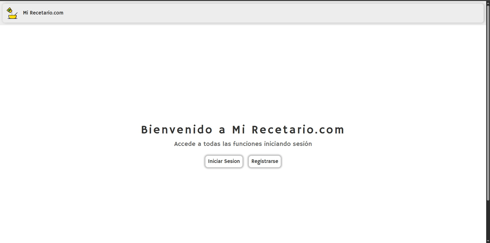
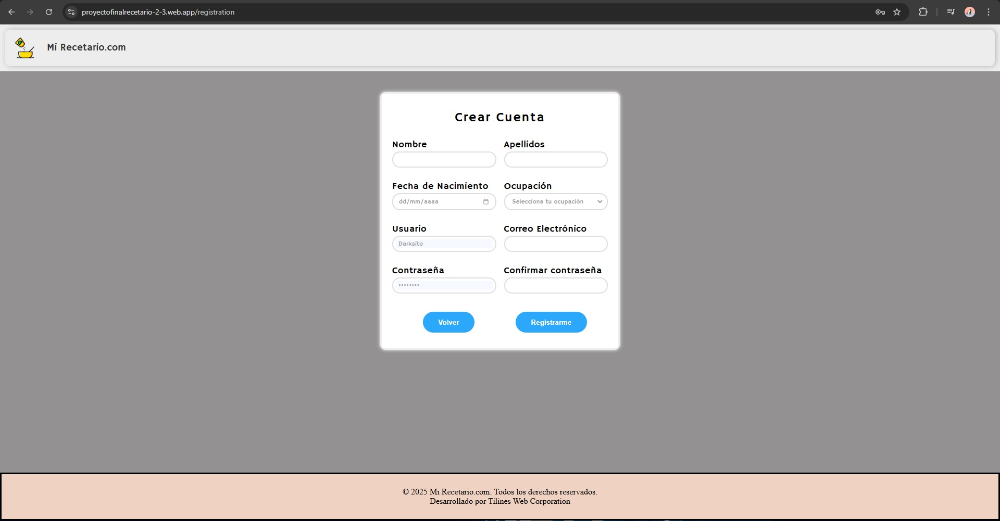
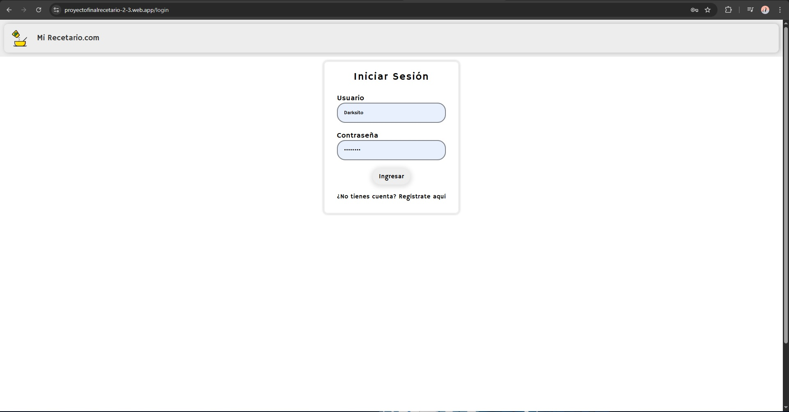
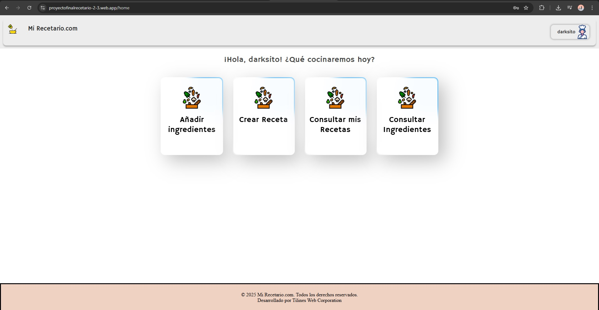
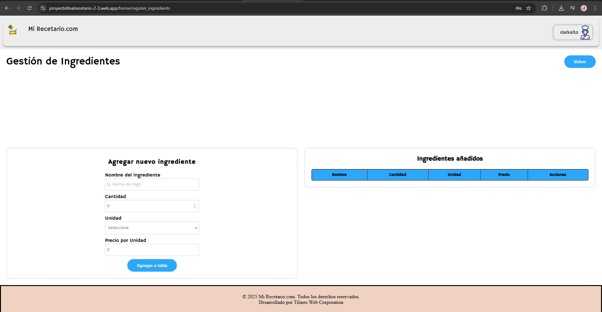
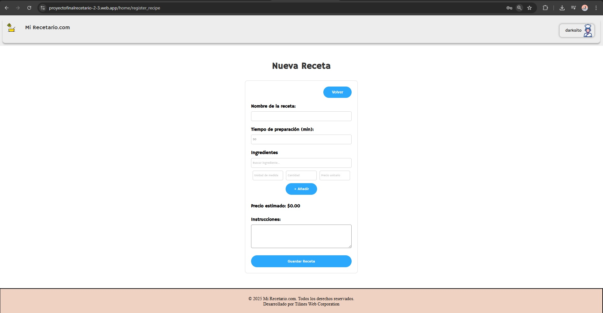
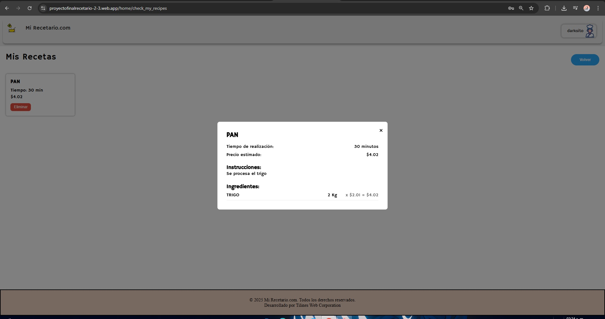
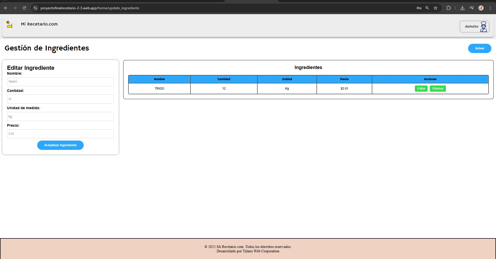
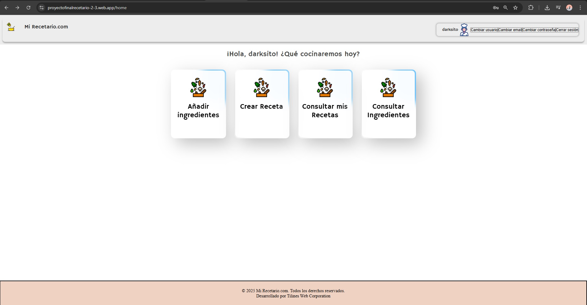

# Proyecto Recetario y Costeos
Proyecto Final DEIS, Elaboracion de un sistema de recetas y costeos 

## Índice

- [URL DEL SISTEMA (CLICK AL ENLACE PARA IR AL SISTEMA)](#url-del-sistema-click-al-enlace-para-ir-al-sistema)
- [Documentacion Tecnica](#documentacion-tecnica)
- [Guia de uso (Video)](#guia-de-uso-video)
- [Equipo de trabajo](#--equipo-de-trabajo--)
- [GUIA DE USO RAPIDA](#guia-de-uso-rapida)
  - [Pagina Principal](#pagina-principal)
  - [Pagina Registro](#pagina-registro)
  - [Pagina Iniciar Sesion](#pagina-iniciar-sesion)
  - [Pagina Menu](#pagina-menu)
  - [Gestion de ingredientes](#gestion-de-ingredientes)
  - [Crear Receta](#crear-receta)
  - [Consultar Receta](#consultar-receta)
  - [Consultar Ingrediente](#consultar-ingrediente)
  - [Editar informacion de usuario](#editar-informacion-de-usuario)
- [Tecnologias Utilizadas](#tecnologias-utilizadas)
- [Servidores + Hosts](#servidores--hosts)

### URL DEL SISTEMA (CLICK AL ENLACE PARA IR AL SISTEMA)
## https://proyectofinalrecetario-2-3.web.app/

## Documentacion Tecnica 
* 
* 

## Guia de uso (Video)
* https://drive.google.com/file/d/1N_TFwwpKlz_qFMea56u3Elr_uXDj302U/view?usp=drive_link
  
## - Equipo de trabajo -
* Cárdenas Soto Genaro Isaac (Tester)
* Guerrero Romero José Miguel (Desarrollador)
* Pacheco trujillo jesus martin (Lider de proyecto)
* Zaragoza Cervantes Javier Esau (Analista)
* Palafox Espinoza Miguel Angel (Arquitecto)

# GUIA DE USO RAPIDA

## Pagina Principal
Se cuentan con 2 apartados si no tienes aun una cuenta tendras que registrarte en caso de tenerla seleccionar iniciar sesion 

## Pagina Registro
Es colocar tus datos personales, tus datos de usuario, y por ultimo tu rol ya sea ama de casa o cheft 

## Pagina Iniciar Sesion
Colocar tu nombre de usuario y tu contrasena

## Pagina Menu 
* Anadir Ingredientes 
* Crear Receta 
* Consultar mis recetas 
* Consultar Ingredientes

## Gestion de ingredientes
En este apartado se puede crear un stock de ingredientes para utilizar en las recetas

## Crear Receta
En este apartado se pueden crear nuevas recetas.
**Restriccion:** Para crear una receta es obligatorio que haya ingredientes creados anteriormente.

## Consultar Receta
En este apartado se puede verfiicar cuales son las recetas que tengo almacenadas, al presionar en la receta te dara informacion mas detallada como ingredientes etc, ademas de eso hay  un boton para eliminar la receta si se desea.

## Consultar Ingrediente 
Este apartado te permite verficar los ingredientes que tienes almacenados, asi como poder actualizarlos desde el boton editar y el boton eliminar para poder eliminar ese ingrediente de la BD.

## Editar informacion de usuario
Al presionar en tu nombre de usario que aparece en la esquina podras cambiar tanto tu nombre de usuario como correo como contrasena las veces que quieras.
**Restriccion:** No puede haber nombre de usaurio repetidos y correos.

## Tecnologias Utilizadas 

* **React** (FrontEnd)
* **NodeJS** (BackEnd)

* **Vite** (Generar proyecto FrontEnd)
* **Express** (Generar Proyecto BackEnd)
* **Sequelize** (ORM para la base de datos)
* **PostgreSql** (Base de datos)

## Servidores + Hosts
* **Aiven.io** (Servidor de base de datos)
* **Firebase Host** (Host FrontEnd)
* **Render** (Host BackEnd)
* **UptimeRobot** (Mantener Alive la api)
